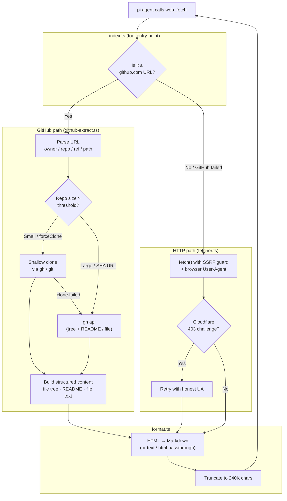

# web-fetch

A `web_fetch` tool fetches content from a URL and converts it into a clean, LLM-friendly representation.

What makes it more than a plain HTTP client:

- **HTML → Markdown** conversion by default (with `text` and `html` alternatives).
- **GitHub-aware extraction** — `github.com` URLs return structured repository content (file trees, README, file text) instead of raw HTML, with a local shallow clone the agent can explore further via `read`/`bash`.
- **Security hardening** — HTTPS upgrade, SSRF protection (blocks private hosts), cross-host redirect detection, size guards, and timeouts.
- **Actionable errors** — failure messages include hints so the model can retry intelligently.

## Architecture



## Components

| File | Role |
|------|------|
| `index.ts` | Tool definition, registration, and request dispatch. Routes GitHub URLs to the GitHub extractor and everything else to the HTTP fetcher; renders results in the TUI. |
| `types.ts` | Shared types (`FetchResult`, `FetchParams`, `FetchError`, `GitHubUrlInfo`, `GitHubCloneConfig`) and constants (timeouts, size limits, GitHub defaults). |
| `fetcher.ts` | Pure HTTP transport: `fetchUrl()` handles URL normalization, SSRF protection, redirects, size guards, timeouts, and Cloudflare UA fallback. Returns a normalized `FetchResult`. |
| `github-extract.ts` | GitHub URL parser and the clone-or-API decision engine. Shallow-clones small repos (with session-local caching), falls back to the `gh` API for large repos or commit-SHA URLs, and assembles structured Markdown content from the result. |
| `github-api.ts` | Thin, non-throwing wrappers around the `gh` CLI: auth detection, repo size, default branch, file tree, README, and single-file fetch. |
| `format.ts` | `formatResultForLLM()` — converts the raw response to the requested format, prepends a redirect banner, and truncates large outputs to protect the context window. |
| `html-to-markdown.ts` | Turndown-backed HTML → Markdown converter that strips scripts/styles/navigation while preserving semantic structure (headings, lists, code blocks). |

## GitHub extraction in detail

When the agent fetches a `github.com` URL, the tool recognizes the URL shape and extracts structured content instead of fetching rendered HTML:

- **Repo root** (`/owner/repo`) → file tree + README.
- **Directory** (`/owner/repo/tree/<ref>/<path>`) → directory listing with file sizes.
- **File** (`/owner/repo/blob/<ref>/<path>`) → file contents (with binary detection and truncation).

The decision between cloning and using the API:

1. **Cached clone?** → reuse the session-local clone.
2. **Full commit-SHA URL?** → use the `gh` API (can't shallow-clone a SHA).
3. **Repo larger than `maxRepoSizeMB`?** → use the `gh` API (tree + README). The `forceClone` parameter overrides this.
4. **Otherwise** → shallow clone (`gh repo clone` when authenticated, `git clone` for public repos as fallback). If cloning fails, fall back to the API.

Non-code GitHub paths (`/issues`, `/pull`, `/discussions`, etc.) are intentionally **not** intercepted — they fall through to the normal HTTP fetcher, since they serve HTML pages rather than repository content.

> **Note:** The `gh` CLI is required for API calls, private repos, and the size-check preflight. Without `gh` authentication, public repos still work via `git clone`.

## Configuration

All configuration is defined in code — there is no external config file. Edit `DEFAULT_GITHUB_CONFIG` in [`types.ts`](./types.ts) to change GitHub behaviour:

```ts
export const DEFAULT_GITHUB_CONFIG: Readonly<GitHubCloneConfig> = {
    enabled: true,            // GitHub extraction on/off
    maxRepoSizeMB: 350,       // repos above this use the API instead of cloning
    cloneTimeoutSeconds: 60,  // hard timeout for a git clone
    clonePath: "/tmp/pi-github-repos", // where shallow clones are stored
};
```

HTTP-fetch defaults (timeout, max bytes, User-Agents) are also constants in `types.ts`.
