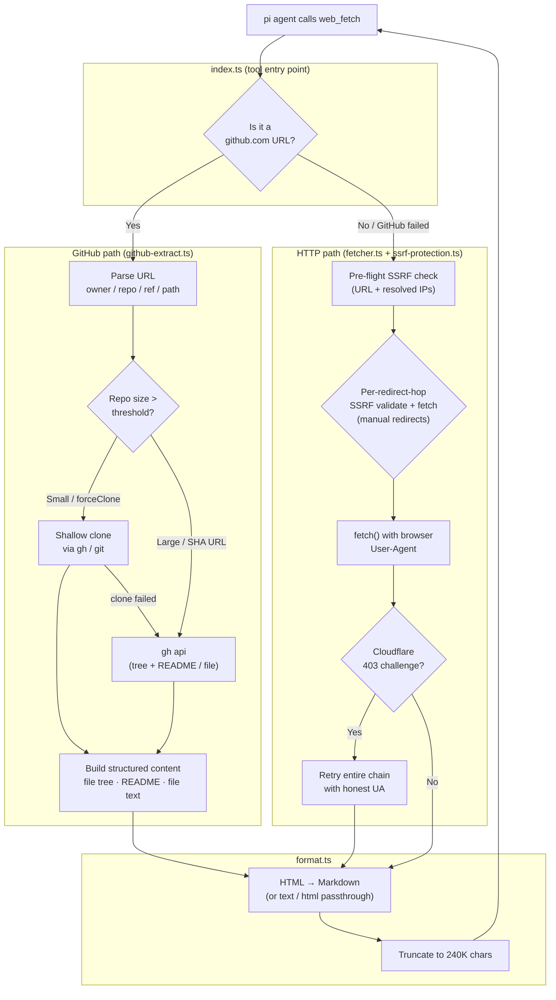

# web-fetch

A `web_fetch` tool fetches content from a URL and converts it into a clean, LLM-friendly representation.

What makes it more than a plain HTTP client:

- **HTML → Markdown** conversion by default (with `text` and `html` alternatives).
- **GitHub-aware extraction** — `github.com` URLs return structured repository content (file trees, README, file text)
  instead of raw HTML, with a local shallow clone the agent can explore further via `read`/`bash`.
- **Security hardening** — HTTPS upgrade, DNS-aware SSRF protection with per-hop redirect validation,
  cross-host redirect detection, size guards, and timeouts.
- **Actionable errors** — failure messages include hints so the model can retry intelligently.

## Architecture

## Components

| File                  | Role                                                                                                                                                                                                                                       |
| --------------------- | ------------------------------------------------------------------------------------------------------------------------------------------------------------------------------------------------------------------------------------------ |
| `index.ts`            | Tool definition, registration, and request dispatch. Routes GitHub URLs to the GitHub extractor and everything else to the HTTP fetcher; renders results in the TUI.                                                                       |
| `types.ts`            | Shared types (`FetchResult`, `FetchParams`, `FetchError`, `GitHubUrlInfo`, `GitHubCloneConfig`) and constants (timeouts, size limits, GitHub defaults).                                                                                    |
| `fetcher.ts`          | Pure HTTP transport: orchestrates URL normalization, SSRF pre-flight checks, Cloudflare UA fallback, timeouts, and size guards on top of the SSRF module. Returns a normalized `FetchResult`.                                              |
| `ssrf-protection.ts`  | DNS-aware SSRF guard. `validateRemoteUrl()` resolves the hostname and rejects any private/reserved IP it maps to; `fetchRemoteUrl()` wraps `fetch()` with `redirect: "manual"` and re-validates every redirect hop before contacting it. |
|                       | Blocks loopback, RFC 1918, CGNAT (100.64/10), link-local (169.254), benchmark (198.18/15), multicast, IPv6 ULA, link-local, and IPv4-mapped addresses. Provides an opt-in `allowRanges` CIDR whitelist for TUN/fake-IP proxies.        |
| `github-extract.ts`   | GitHub URL parser and the clone-or-API decision engine. Shallow-clones small repos (with session-local caching), falls back to the `gh` API for large repos or commit-SHA URLs, and assembles structured Markdown content from the result. |
| `github-api.ts`       | Thin, non-throwing wrappers around the `gh` CLI: auth detection, repo size, default branch, file tree, README, and single-file fetch.                                                                                                      |
| `format.ts`           | `formatResultForLLM()` — converts the raw response to the requested format, prepends a redirect banner, and truncates large outputs to protect the context window.                                                                         |
| `html-to-markdown.ts` | Turndown-backed HTML → Markdown converter that strips scripts/styles/navigation while preserving semantic structure (headings, lists, code blocks).                                                                                        |

## GitHub extraction in detail

When the agent fetches a `github.com` URL, the tool recognizes the URL shape and extracts structured content instead of
fetching rendered HTML:

- **Repo root** (`/owner/repo`) → file tree + README.
- **Directory** (`/owner/repo/tree/<ref>/<path>`) → directory listing with file sizes.
- **File** (`/owner/repo/blob/<ref>/<path>`) → file contents (with binary detection and truncation).

The decision between cloning and using the API:

1. **Cached clone?** → reuse the session-local clone.
2. **Full commit-SHA URL?** → use the `gh` API (can't shallow-clone a SHA).
3. **Repo larger than `maxRepoSizeMB`?** → use the `gh` API (tree + README). The `forceClone` parameter overrides this.
4. **Otherwise** → shallow clone (`gh repo clone` when authenticated, `git clone` for public repos as fallback). If
   cloning fails, fall back to the API.

Non-code GitHub paths (`/issues`, `/pull`, `/discussions`, etc.) are intentionally **not** intercepted — they fall
through to the normal HTTP fetcher, since they serve HTML pages rather than repository content.

> **Note:** The `gh` CLI is required for API calls, private repos, and the size-check preflight. Without `gh`
> authentication, public repos still work via `git clone`.

## SSRF protection in detail

The tool is exposed to arbitrary URLs chosen by the LLM (or supplied by the user), so the fetcher needs to defend
against server-side request forgery — attacks that coerce the server into contacting internal/private network
resources. Protection happens at two layers:

1. **Pre-flight validation** (`validateRemoteUrl`) runs immediately after URL normalization, before the timeout
   timer starts. It rejects:
   - Non-`http`/`https` protocols (`file:`, `ftp:`, `gopher:` …).
   - The literal hostnames `localhost` and `*.localhost`.
   - Any literal-IP hostname in a blocked RFC range.
   - Hostnames that resolve (via DNS) to a blocked IP. This closes the DNS-rebinding vector: a public-looking
     domain whose A record points at `169.254.169.254` (cloud metadata) is caught here.

2. **Per-hop redirect validation** runs inside the transport (`fetchRemoteUrl`). The fetcher uses
   `redirect: "manual"` and, for every `301`/`302`/`303`/`307`/`308` it observes, it resolves the `Location`
   target through the same guard *before* following it. This prevents a public URL from 302-ing into an internal
   address — a bypass that defeats any single-shot validation.

### Blocked address ranges

| IPv4                          | What it covers                                        |
| ----------------------------- | ----------------------------------------------------- |
| `0.0.0.0/8`                   | "This host" / current network                         |
| `10.0.0.0/8`                  | RFC 1918 private                                      |
| `127.0.0.0/8`                 | Loopback                                              |
| `100.64.0.0/10`               | Carrier-grade NAT                                     |
| `169.254.0.0/16`              | Link-local (includes `169.254.169.254` metadata svc)  |
| `172.16.0.0/12`               | RFC 1918 private                                      |
| `192.168.0.0/16`              | RFC 1918 private                                      |
| `198.18.0.0/15`               | Benchmarking                                          |
| `224.0.0.0/4`+                | Multicast/reserved                                    |

| IPv6                          | What it covers                                        |
| ----------------------------- | ----------------------------------------------------- |
| `::/128`                      | Unspecified                                           |
| `::1/128`                     | Loopback                                              |
| `fc00::/7`                    | ULA (Unique Local Addresses)                          |
| `fe80::/10`                   | Link-local                                            |
| `::ffff:x.x.x.x`              | IPv4-mapped — checked against IPv4 blocklist too      |

### Escape hatch for TUN/fake-IP proxies

Proxy setups like Surge, Clash, or Mihomo rewrite public domains into reserved ranges (commonly
`198.18.0.0/15`) to perform transparent DNS/TLS interception. Those requests would normally be blocked.

Pass `allowRanges: string[]` (CIDR notation) on `FetchParams` to exempt specific ranges. The entries are
validated strictly — malformed CIDR throws, so a misconfigured whitelist cannot silently disable protection.

> **Note:** `allowRanges` is currently plumbed but not yet exposed as a configurable tool parameter. To use it,
> read the value from your extension config and pass it into `fetchUrl({ ..., allowRanges })` in `index.ts`.

## Configuration

| Concern       | Where to edit                                                              |
| ------------- | -------------------------------------------------------------------------- |
| GitHub        | `DEFAULT_GITHUB_CONFIG` in [`types.ts`](./types.ts)                        |
| HTTP fetch    | Timeouts (`DEFAULT_TIMEOUT_MS`, `MAX_TIMEOUT_MS`), size (`MAX_BYTES`), User-Agents in `types.ts` |
| SSRF whitelist | Read `allowRanges` from extension config → pass as `FetchParams.allowRanges` in `index.ts` |

All defaults are defined in code — there is no external config file.
